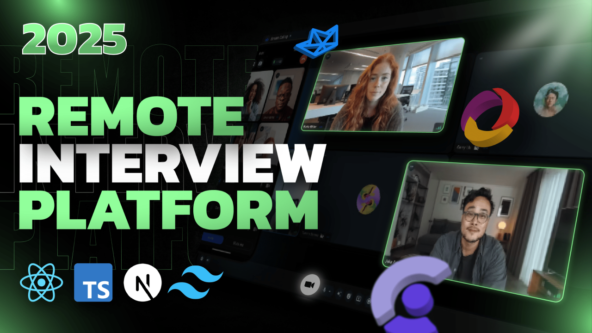

<h1 align="center">✨ CodeSync - Video Calling Interview Platform ✨</h1>

<p align="center">
  
</p>

<p align="center">
  <b>🚀 2025 — <span style="color:#22c55e;">REMOTE INTERVIEW PLATFORM</span></b>
</p>

---

## 🏆 Highlights

- 💻 **Tech Stack**: Next.js + TypeScript, Stream, Convex, Clerk  
- 🎥 Video Calls  
- 📤 Screen Sharing  
- 🎬 Recording  
- 🔐 Authentication & Authorization  
- ⚛️ Server & Client Components  
- 🔄 Dynamic & Static Routes  
- 🎨 Beautiful UI with **TailwindCSS** + **Shadcn**  
- ⚡ Server Actions  

---

## ⚡ Quick Start

### 1️⃣ Clone & Install
```bash
git clone https://github.com/yourusername/CodeSync-Online-Interview-Platform.git
cd CodeSync-Online-Interview-Platform
npm install
2️⃣ Create .env.local
bash
Copy
Edit
NEXT_PUBLIC_CLERK_PUBLISHABLE_KEY=
CLERK_SECRET_KEY=
CONVEX_DEPLOYMENT=
NEXT_PUBLIC_CONVEX_URL=
NEXT_PUBLIC_STREAM_API_KEY=
STREAM_SECRET_KEY=
📝 Fill these with your API keys from Clerk, Convex, and Stream.

3️⃣ Run the App
bash
Copy
Edit
npm run dev
Visit http://localhost:3000 in your browser.
